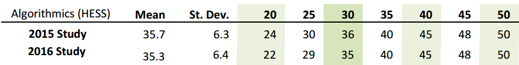

# About VCE Algorithmics

VCE Algorithmics is a new [HESS](/other/credit) Unit 3/4 subject, developed by Monash University and Melbourne University. It aims to give students an introduction to the study of algorithms, allowing them to understand the foundations of computer science and software engineering.

This subject is best suited for those interested in Computer Science or Mathematics, as well as students good at problem solving. It focuses less on programming and more on the underlying logic and mathematics behind the scenes.

## Prerequisites

Algorithmics has a list of assumed mathematics knowledge that students are expected to know [(SD page 6)](http://www.vcaa.vic.edu.au/Documents/vce/algorithmics/AlgorithmicsSD-2017.pdf) :

 - sets and set operations (union, intersection)
 - substitution and transposition in linear and non-linear relations
 - the construction of tables of values from a given formula
 - development of formulas from word descriptions
 - sequences and linear relations generated by recursion
 - exponents and logarithms
 - the ability to produce and interpret numerical plots

Most of this is covered in Mathematical Methods Units 1/2, and Students are expected to be concurrently studying or to have completed these units.

## Scaling

Algorithmics can be a fairly difficult subject, and scales up a fair amount.

[In addition, both Monash and Melbourne Universities have credit available for students who have completed Algorithmics.](credit)

## Where can I do this subject?

Algorithmics is a new subject (first introduced in 2015). If your school doesn't offer it, you may have to do it as distance education. [Distance Education Victoria](http://www.distance.vic.edu.au/subject-tasters/algorithmics-unit-3-4-4/) currently offers this subject. If you can't do that, feel free to use these resources to do your own personal study, or look into a Computer Science at Universities.

For more information on the subject, look at the [VCAA Algorithmics Study Design.](studydesign)

