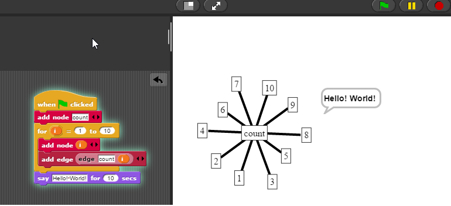

# This page still under construction

Edgy is a block based programming language based on Snap! Modified with JSNetworkX, Edgy provides an easy introduction to programming with a focus on graph algorithms. Tutorials for edgy can be found [here](https://www.alexandriarepository.org/syllabus/programming-with-edgy/), and edgy itself can be found [here](https://snapapps.github.io/edgy/app/edgy.html) (please note, ad blockers may need to be disabled if the site doesn't load for you)

Here is a basic example of an edgy program that demonstrates some of it's features.

Students who are familiar with text-based languages may wish to check out [Python](/programming/python), a text-based language that is also VCAA approved.

This is one of the three languages allowed for [2017](http://www.vcaa.vic.edu.au/Pages/vce/studies/algorithmics/algorithmics-approved-lists.aspx)